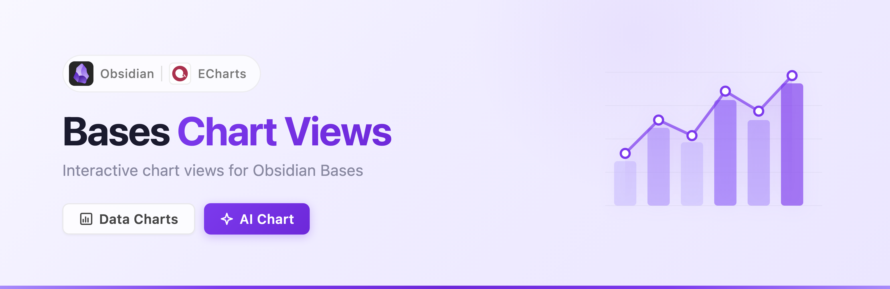
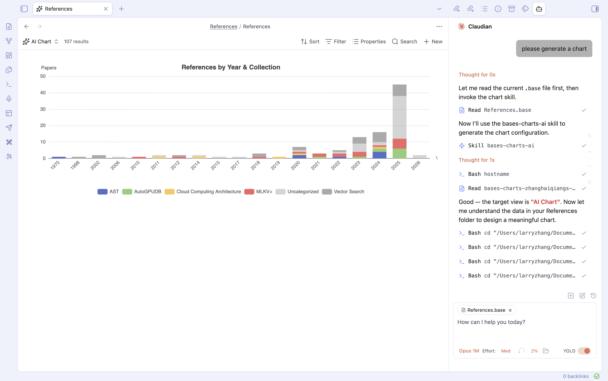

# Bases Chart Views

**Data Charts + AI Charts for [Obsidian Bases](https://help.obsidian.md/bases)**

An [Obsidian](https://obsidian.md) plugin that adds interactive chart views to Bases, powered by [Apache ECharts](https://echarts.apache.org/). Build data-driven charts manually or generate any ECharts visualization with AI via [Claudian](https://github.com/YishenTu/claudian).

### Design Philosophy

This plugin offers two fundamentally different approaches to charting:

- **Data Charts** — Each supported chart type is carefully crafted with purpose-built controls for aggregation, grouping, axis configuration, and interactivity. Rather than exposing the full complexity of ECharts, we focus on polishing a curated set of chart types and gradually expanding support.
- **AI Chart** — Fully AI-driven. You simply describe what you want in a conversation with Claudian, and it handles everything — reading your data, choosing the right chart type, and writing the complete ECharts configuration. No manual configuration needed.

## How It Works

1. Create a [Base](https://help.obsidian.md/bases) in your vault.
2. Add a new view and select a chart type — either a **Data Chart** (Scatter, Line, Bar, Pie) or an **AI Chart**.
3. For Data Charts, configure the X axis and Y axes in the view settings. The plugin reads your Bases data and renders charts automatically.
4. For AI Charts, install [Claudian](https://github.com/YishenTu/claudian) first. The plugin has deep integration with Claudian — you can chat with it to generate, modify, and iterate on any ECharts visualization. See [AI Chart](#ai-chart) for details.

## Data Charts

Built-in chart views that visualize Bases data with configurable axes, aggregation, and grouping.

- **Scatter** — individual data points, optional labels, click to open source file
- **Line** — connected data points, configurable gap handling (Leave gap or Fill with 0)
- **Bar** — grouped bars with optional data labels and percentage display
- **Pie** — donut chart with optional labels, percentages, and null filtering

### Features

- Multiple Y axes: each Y property produces a separate chart
- Per-property aggregation: set Sum, Average, Count, Min, Max (or None for Scatter) independently for each Y axis
- Sync Y axes and min/max override across charts
- Group by support: groups become colored series within each chart
- Interactive tooltips with clickable file links
- X axis sorting via Bases Sort configuration

## AI Chart

Generate any ECharts visualization using [Claudian](https://github.com/YishenTu/claudian). The AI Chart view supports the full ECharts option spec — line, bar, scatter, pie, radar, heatmap, treemap, sunburst, graph, sankey, gauge, funnel, candlestick, boxplot, parallel, and more.

### Setup

1. Add an **AI Chart** view to your Base.
2. Click **Set up AI Chart** to install the Claudian skill (requires [Claudian](https://github.com/YishenTu/claudian)).
3. Ask Claudian to generate a chart — it reads your data and writes the ECharts configuration directly to the `.base` file.
4. The chart renders automatically. Edit via Claudian to iterate on the visualization.

## General

- Auto-resize and responsive layout
- Light and dark theme support
- Mobile-optimized layout

## Installation

### BRAT (recommended)

1. Install the [BRAT](https://github.com/TfTHacker/obsidian42-brat) plugin.
2. In BRAT settings, click **Add Beta Plugin**.
3. Enter `https://github.com/haiqiang-zhang/obsidian-bases-charts` and click **Add Plugin**.
4. Enable **Bases Chart Views** in Settings > Community plugins.

### Manual

1. Download `main.js`, `manifest.json`, and `styles.css` from the [latest release](https://github.com/haiqiang-zhang/obsidian-bases-charts/releases/latest).
2. Create a folder `bases-chart-views` in your vault's `.obsidian/plugins/` directory.
3. Copy the downloaded files into that folder.
4. Enable **Bases Chart Views** in Settings > Community plugins.

## License

[GPL-3.0](https://choosealicense.com/licenses/gpl-3.0/)

## Acknowledgements

Based on [obsidian-bases-charts-plugin](https://github.com/mProjectsCode/obsidian-bases-charts-plugin) by [mProjectsCode](https://github.com/mProjectsCode). Rewritten with [Apache ECharts](https://echarts.apache.org/) for improved rendering and features.

## Contributions

Contributions are always welcome. If you have an idea, feel free to open a feature request under the issue tab or create a pull request.
